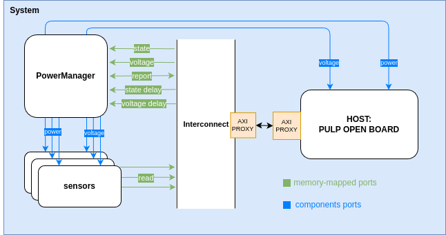
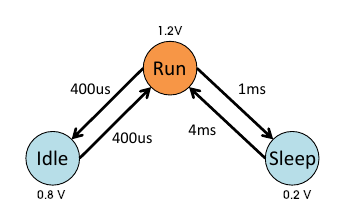
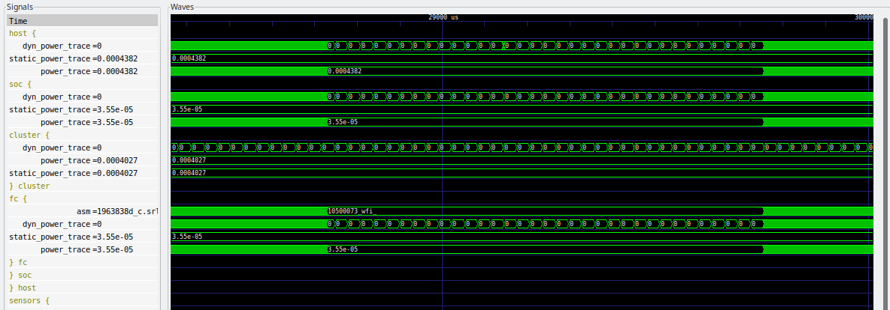
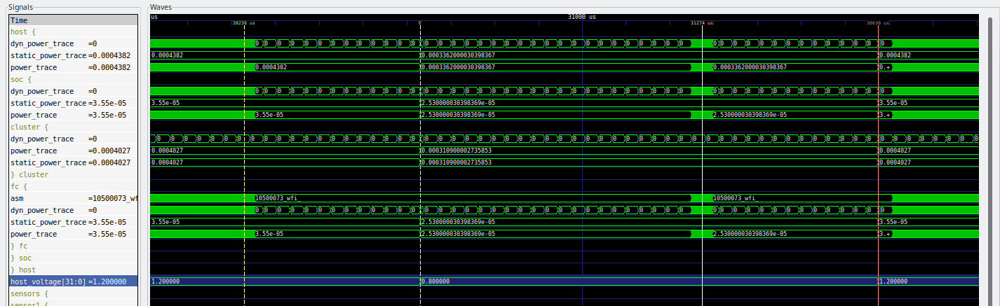
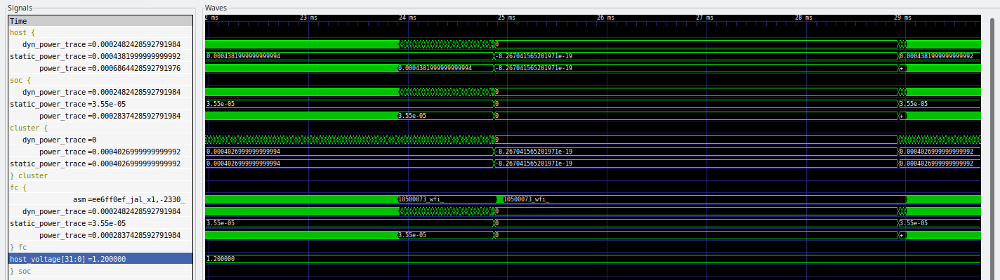
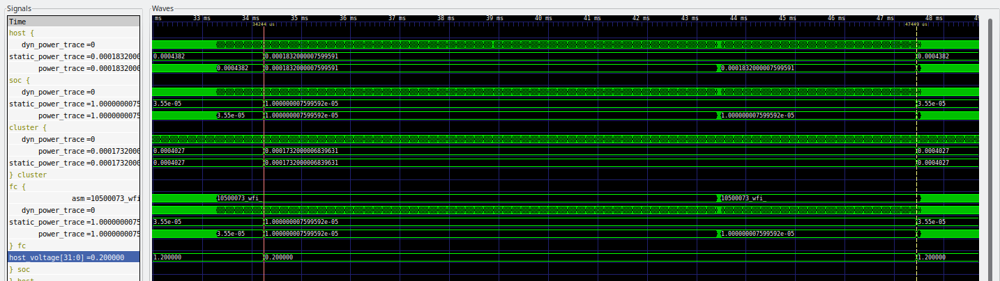

# Implementation of Dynamic Power Management Policies in a RISC-V Instruction Set Simulator

## Table of Contents

- [Introduction](#introduction)
- [Repository Stucture](#repository-structure)
- [Prerequisite](#prerequisite)
  - [riscv gnu compiler toolchain](#riscv-gnu-compiler-toolchain)
  - [pulp compiler and sdk](#pulp-compiler-and-sdk)
  - [Instaling GVSoC](#installing-gvsoc)
- [Modeling components in GVSoC](#modeling-components-with-gvsoc)
  - [Create Systems and Components](#build-system-and-components)
    - [Build a simple system](#build-a-simple-system)
    - [Building a component](#building-a-component)
    - [Power Modeling](#control-the-power-of-each-component)
    - [About Power in GVSoC](#about-power-in-gvsoc)
      - [Describing power sources and setting parameters](#describing-power-sources-and-setting-parameters)
    - [Timing in GVSoC](#timing-in-gvsoc)
- [Description of the Power manager component](#description-of-the-power-manager-component)
  - [pm_functions library](#pm_functions-library)
  - [Create new states](#describing-a-new-state)
  - [Workload Examples](#workload-examples)
- [Limitations of GVSoC for power modeling](#limitations-of-gvsoc-for-power-modeling)

## Introduction

This repository focuses on the implementation of Dynamic Power Management (DPM) policies within a RISC-V Instruction Set Simulator. DPM policies are essential for optimizing power consumption in embedded systems by dynamically adjusting the power states and voltages of various components based on their activity levels.

To facilitate the application of these policies, a specialized component called the Power Manager has been developed. This component is capable of controlling the power state and voltage of other components within the simulated system. The Power Manager operates through memory-mapped ports, allowing it to be easily integrated and controlled via firmware running on the simulated core. By writing to these ports, the power state and voltage of connected components can be adjusted, enabling power management. Additionally, delays for every transition can be specified, allowing for more realistic control over the timing of power changes.

## Repository structure

~~~bash
├── dpm_old
├── pulpdpm
│   ├── app
│   └── examples
└── tutorials
    ├── 0_how_to_build_a_system_from_scratch
    ├── 14_how_to_add_power_traces_to_a_component
    ├── 1_how_to_write_a_component_from_scratch
    ├── 2_how_to_make_components_communicate_together
    ├── 6_how_to_add_timing
    └── utils
~~~

This repository contains relevant tutorials (tutorials folder) from the official GVSoC repository, together with a short guide on how to work with the simulator and two example system, where the power_manager component is able to modify the power state of the component acting on the main power and voltage port:

- dpm_old: contains a simpler system with a _ri5cy_ core, and a first version of the Powermanager component.
- pulpdpm: contains a system with _pulp open board_ chip, and the final version of the component.

In both cases the Power Manager component is able to change the power state and voltage of the components by operating on the memory mapped registers directly from the firmware runnning on the simulated core. Additionally, for the `pulpdpm` system, different workloads have been modeled in various firmware examples present in the `examples` folder. These examples demonstrate how the Power Manager component can be used to manage power states and voltages under different workload conditions.

In each folder is present a Makefile to automate the compilation of GVSoC and the firmware to run on the core. In pulpdpm folder available commands are:

~~~
clean: clean all, including gvsoc build directory and builded firmware

config: Prepares GVSoC config file with tracing and VCD enabled. Component traces can be added using the runner_args variable, e.g. runner_args=--trace=fc/comp --trace=pm

config_notrace: Prepares the build directory and configures gvsoc with VCD enabled but no trace, needed for estimating the power consumption.

config_powervcd: Prepares the build directory and configures gvsoc with VCD enabled, generating the waveforms with only power related signals.

run: Runs gvsoc GVSoC without the launcher, the communication between the PULP core and the PowerManager component will not work.

run_launcher: Run GVSoC using the simple developed launcher, that forward the communication from the PULP core to the PowerManager and viceversa.

open_vcd: Opens the GTKWave tool with the generated vcd file.
~~~

To run the simulation for the first time, follow these steps:

1. Compile GVSoC:
    ~~~bash
    make gvsoc
    ~~~

2. Create the configuration file:

    ~~~bash
    make config
    ~~~

    Alternatively, you can use one of the configuration variants.

3. Compile an application:

    ~~~bash
    make app SOURCE=fast_workload.c
    ~~~

4. Run the simulation:

    ~~~bash
    make run_launcher
    ~~~

Note: Different configurations may affect the simulation duration, as generating the VCD waveform can take additional time.

## Prerequisite

### riscv gnu compiler toolchain

The  GVSoC software need the riscv version of gcc compile, the following code installs both 32 and 64 bits version

~~~shell
git clone --recursive https://github.com/riscv/riscv-gnu-toolchain

sudo apt-get install autoconf automake autotools-dev curl python3 python3-pip libmpc-dev libmpfr-dev libgmp-dev gawk build-essential bison flex texinfo gperf libtool patchutils bc zlib1g-dev libexpat-dev ninja-build git cmake libglib2.0-dev libslirp-dev

cd riscv-gnu-toolchain

./configure --prefix=/opt/riscv --enable-multilib

make 
~~~

### pulp compiler and sdk

In order to compile application for pulp open, the pulp sdk is needed.
A simpler way to setup all the requirements of the toolchain is to use the Docker image of the MESSY simulator, following the instructions at this [link](https://eml-eda.github.io/messy/docker/).

Once docker is set it is possible to use the makefile present in the _pulpdpm_ folder, by running the container with the command:

~~~bash
docker run -it --rm -v $(pwd):/messy messy:latest
~~~

And then using

~~~bash
make app
~~~

By default this command compiles the main.c example found in _examples_ folder. To compile the other examples it is sufficient to add an argument SOURCE:

~~~bash
make app SOURCE=slow_workload.c
~~~

### Installing GVSoC

GVSoC can be installed by following the instruction found in this [repository](https://github.com/eml-eda/gvsoc). To automate the process a script has been wrote to clone and install the tool automatically (clone_and_install_gvsoc.sh). The bin (_gvsoc/bin_) folder containing gvsoc executable has to be added to PATH environment variable.

## Modeling components with GVSoC

## Build system and components

### Build a simple system

In order to build a system, _Python Generators_ are exploited to assemble the different components together. It is mandatory to declare the top level entity of our system as a target for the runner _**gapy**_, by inheriting the _gvsoc.runner.Target_ class and setting **GAPY_TARGET** to true:

~~~python
import gvsoc.runner

GAPY_TARGET = True

class Target(gvsoc.runner.Target):

    def __init__(self, parser, options):
        super(Target, self).__init__(parser, options,
            model=Rv64, description="RV64 virtual board")
~~~

The _model_ argument is the name of the class of the system that is going to be implemented.

All components, and also the system, are declared inheriting the _**gvsoc.systree.Component**_ class.

~~~python
class Rv64(gvsoc.systree.Component):

    def __init__(self, parent, name, parser, options):
        super().__init__(parent, name, options=options)
            
        clock = vp.clock_domain.Clock_domain(self, "clock", 
            frequency=100000000)
            
        soc = SoC(self, "soc", parser)
            
        clock.o_CLOCK(soc.i_CLOCK())
~~~

Note that the _parser_ option is not propagated but can be used to get or declare the command line arguments.

In this example the **Rv64** class instantiate a clock component and the actual system (_SoC_), consequently it connects the output port of the clock generator to the input clock port of the _Soc_  object. The clock is automatically propagated to the components included in _Soc_ class, which code is:

~~~python
class Soc(gvsoc.systree.Component):

    def __init__(self, parent, name, parser):
        super().__init__(parent, name)

        [args, __] = parser.parse_known_args()

        binary = args.binary

        # Main memory
        mem = memory.memory.Memory(self, "mem",     size=0x00100000)

        # Main interconnect
        ico = interco.router.Router(self, "ico")
        ico.o_MAP(mem.i_INPUT(), "mem", base=0x00000000, size=0x00100000, rm_base=True)

        # Instantiates the main core and connect fetch and
        # data to the interconnect
        host = cpu.iss.riscv.Riscv(self, "host", isa="rv64imafdc")
        host.o_FETCH(ico.i_INPUT())
        host.o_DATA(ico.i_INPUT())
        host.o_DATA_DEBUG(ico.i_INPUT())

        # ELF loader will execute first and will then 
        # send to the core the boot address and 
        # notify him he can start

        loader = utils.loader.loader.ElfLoader(self, "loader", binary=binary)

        loader.o_OUT(ico.i_INPUT())
        loader.o_START(host.i_FETCHEN())
        loader.o_ENTRY(host.i_ENTRY())

        gdbserver.gdbserver.Gdbserver(self, "gdbserver")
~~~

The SoC class consists of 3 main components:

- Host CPU: the riscv 64 bit core
- Memory: generic memory from the module library.
- Loader: the component responsible for loading the binary code to the core.
- Main interconnect: the component that handles the interconnection between the components. In this example, it maps the memory at base address 0x00000000.

the last line (_gdbserver_) is optional, and it permits to activate a gdb server in order to debug the execution of the firmware.

### Building a component

In order to describe a new component, it is needed to create a python script (_generator_) like following example:

~~~python

class MyComp(gvsoc.systree.Component):
    def __init__(self, parent: gvsoc.systree.Component, name: str, value: int):#parent and name are mandatory
        super().__init__(parent, name)
        self.add_sources(['my_comp.cpp'])
        self.add_properties({#add value parameter to the json configuration of the component
            "value": value
        })
    #input port, the name of the interface should correspond to the one in c++ code
    def i_INPUT(self) -> gvsoc.systree.SlaveItf:
        return gvsoc.systree.SlaveItf(self, 'input', signature='io')
~~~

When defining a new component, it is mandatory to provide the constructor of its class with the parent and name argument. The cpp code associated to the component is linked by the _add_sources_ function. If the components holds some additional feature (e.g. it stores a value), it can be added to the json configuration through the function _add_properties_. The behavior of the component is described through c++ code. The following code follows the python example:

~~~cpp
#include <vp/vp.hpp>
#include <vp/itf/io.hpp>

class MyComp : public vp::Component
{
public:
    MyComp(vp::ComponentConf &config);

private:
    static vp::IoReqStatus handle_req(vp::Block *__this, vp::IoReq *req);
    vp::IoSlave input_itf;
    uint32_t value;
};

MyComp::MyComp(vp::ComponentConf &config)
    : vp::Component(config)
{
    this->input_itf.set_req_meth(&MyComp::handle_req);
    this->new_slave_port("input", &this->input_itf);
    this->value = this->get_js_config()->get_child_int("value");
}

vp::IoReqStatus MyComp::handle_req(vp::Block *__this, vp::IoReq *req)
{
    MyComp *_this = (MyComp *)__this;

    printf("Received request at offset 0x%lx, size 0x%lx, is_write %d\n",
        req->get_addr(), req->get_size(), req->get_is_write());
    if (!req->get_is_write() && req->get_addr() == 0 && req->get_size() == 4)
    {
        *(uint32_t *)req->get_data() = _this->value;
    }
    return vp::IO_REQ_OK;
}

extern "C" vp::Component *gv_new(vp::ComponentConf &config)
{
    return new MyComp(config);
}

~~~

Let's break down the code and highlight its features:

- The declared class (_MyComp_) inherits from the Component base class of the gvsoc library.
- Its constructor is call by the GVSoC simulator passing the configuration file.
- Inside the constructor the interface is linked with the function _new_slave_port_ and its handler is connected with _set_req_meth_. The name passed as argument is the same as the interface returned in the python method _i_INPUT_. Also, the configuration is retrieved from the python description with _get_js_config_ (in this example, the parameter _value_).
- The function _**gv_new**_ is needed by the framework in order to instantiate the class when the component is loaded.
- The handle of the interface port (_handle_req_) its called everytime a request must be handled. The method is necessarily static and it receives the instance of the class as argument.

Taking as an example the previous system code, in order to connect the new component, a few lines have to be added in the top system class:

~~~python
    comp = my_comp.MyComp(self, 'my_comp', value=0x12345678)
    ico.o_MAP(comp.i_INPUT(), 'comp', base=0x20000000, size=0x00001000, rm_base=True)
~~~

In these lines, the class MyComp is instantiated with a defined value, then its port is mapped by the interconnect object to a defined address that will be accessed by the binary to be executed.

The _Component_ object provides some basic connection port, which are consequently inherited by all the describred components:

- i_RESET() : a boolean port to control the reset signal
- i_CLOCK() : a port to which a clock generator should be connected
- i_POWER() : a port that can be exploit to change the power state choosing from theavailable states.
- i_VOLTAGE() : a port for controlling the component voltage (expressed as int)

### Control the power of each component

Power modeling is based on power sources.
The following example component can control the power state of a secondary connected component through two ports:

~~~cpp
//in class declaration
vp::WireMaster<int> power_ctrl_itf;
vp::WireMaster<int> voltage_ctrl_itf;
    ...
//in component constructor
this->new_master_port("power_ctrl", &this->power_ctrl_itf);
this->new_master_port("voltage_ctrl", &this->voltage_ctrl_itf);
~~~

In this example the two ports are controlled through registers:

- the first consists of 2 bit: the LSB stating if the component is active (i.e. consuming power), the other bit activates the clock of the component.
- the second register holds the voltage value.

~~~cpp
if (req->get_size() == 4){
    if (req->get_addr() == 0){
        if (req->get_is_write()){
            int power = (*(uint32_t *)req->get_data()) & 1;
            int clock = ((*(uint32_t *)req->get_data()) >> 1) & 1;
            int power_state;
            if (power){
                if (clock){
                    power_state = vp::PowerSupplyState::ON;
                } else {
                        power_state = vp::PowerSupplyState::ON_CLOCK_GATED;
                    }
            } else {
                    power_state = vp::PowerSupplyState::OFF;
            }
            _this->power_ctrl_itf.sync(power_state);
            }
        }
    else if (req->get_addr() == 4){
            if (req->get_is_write()){
                int voltage = *(uint32_t *)req->get_data();
                _this->voltage_ctrl_itf.sync(voltage);
            }
        }
    }
~~~

As shown in the code example the power state of the component is set by calling the _sync_ function of each interface, that will be connected to the _power_ and _voltage_ input ports of a second component.
The definition of the power metrics of the two sources are described in the Python generator.
They consists in measured power consumption at different voltage level, temperature and frequency.

~~~python
self.add_properties(
            {
                "background_power": {
                    "dynamic": {
                        "type": "linear",
                        "unit": "W",
                        "values": {
                            "25": {
                                "600.0": {"any": 0.00020},
                                "1200.0": {"any": 0.00050},
                            }
                        },
                    },
                    "leakage": {
                        "type": "linear",
                        "unit": "W",
                        "values": {
                            "25": {
                                "600.0": {"any": 0.00005},
                                "1200.0": {"any": 0.00010},
                            }
                        },
                    },
                },
                "access_power": {
                    "dynamic": {
                        "type": "linear",
                        "unit": "pJ",
                        "values": {
                            "25": {
                                "600.0": {"any": 5.00000},
                                "1200.0": {"any": 10.00000},
                            }
                        },
                    }
                },
            }
        )
~~~

This example models the power for any frequency, at temperature of 25 Celsius, of two different voltage levels.
The framework interpolates the power values based on the given parametrics.
In order to take care of the clock gating the _power_supply_set_ _callback_ method has to be overloaded, in the component which power state is controlled.

~~~cpp
void MyComp::power_supply_set(vp::PowerSupplyState state)
{
    if (state == vp::PowerSupplyState::ON)
    {
        this->background_power.dynamic_power_start();

    }
    else
    {
        this->background_power.dynamic_power_stop();
    }
}
~~~

The overloaded function just turn on the dynamic power counter as soon as the power state is _ON_ whether in the case of the _ON_CLOCK_GATED_ and _OFF_ states, the dynamic component of the power is stopped.
To model the power of the acceses ( e.g. access to the memory or instruction) the framework relies on energy quantum that are interpolated depending on the voltage. This quantity needs only to be assign through the instruction:

~~~cpp
_this->access_power.account_energy_quantum();
~~~

Finally the output power ports are added to the python generator of the component and bind to the second component into the system top python class.

~~~python
#in my_comp.py classes
def o_POWER_CTRL(self, itf: gvsoc.systree.SlaveItf):
    self.itf_bind('power_ctrl', itf, signature='wire<int>')

def o_VOLTAGE_CTRL(self, itf: gvsoc.systree.SlaveItf):
    self.itf_bind('voltage_ctrl', itf, signature='wire<int>')

#in my_system.py constructor
comp2 = my_comp.MyComp2(self, 'my_comp2')
ico.o_MAP(comp2.i_INPUT(), 'comp2', base=0x30000000, size=0x00001000, rm_base=True)
comp2.o_POWER_CTRL( comp.i_POWER())
comp2.o_VOLTAGE_CTRL( comp.i_VOLTAGE())
~~~

Note that every component inherited from _gvsoc.systree.Component_ is already provided with input power and voltage port (_i_POWER()_ an _i_VOLTAGE()_).

The simulated binary (Tutorial 14 -> main.c) go through the possible states and outputs the power consumption of the system.

~~~ c
int main()
{
   int voltages[] = { 600, 800, 1200};

for (int i=0; i<sizeof(voltages)/sizeof(int); i++)
{
    printf("Voltage %d\n", voltages[i]);

    *(volatile uint32_t *)0x30000004 = voltages[i];

    // Mesure power when off and no clock
    printf("OFF\n");
    *(volatile uint32_t *)0x10000000 = 0xabbaabba;
    *(volatile uint32_t *)0x10000000 = 0xdeadcaca;

    // Mesure power when on and no clock
    printf("ON clock-gated\n");
    *(volatile uint32_t *)0x30000000 = 1;
    *(volatile uint32_t *)0x10000000 = 0xabbaabba;
    *(volatile uint32_t *)0x10000000 = 0xdeadcaca;

    // Mesure power when on and clock
    printf("ON\n");
    *(volatile uint32_t *)0x30000000 = 0x3;
    *(volatile uint32_t *)0x10000000 = 0xabbaabba;
    *(volatile uint32_t *)0x10000000 = 0xdeadcaca;

    // Mesure power with accesses
    printf("ON with accesses\n");
    *(volatile uint32_t *)0x10000000 = 0xabbaabba;
    for (int i=0; i<20; i++)
    {
        *(volatile uint32_t *)0x20000000 = i;
    }
    *(volatile uint32_t *)0x10000000 = 0xdeadcaca;

    *(volatile uint32_t *)0x30000000 = 0;

    printf("\n\n");
}
}
~~~

In this example the address _0x10000000_ is mapped to a memory that acts as a power trigger: writing "0xabbaabba" starts capturing the consumed power, writing "0xdeadcaca" stops the capture and print the measured values on the trace logged into the terminal.

~~~bash
Voltage 600
OFF
@power.measure_0@0.000000@
ON clock-gated
@power.measure_1@0.000050@
ON
@power.measure_2@0.000250@
ON with accesses
@power.measure_3@0.000333@

Voltage 800
OFF
@power.measure_4@-0.000000@
ON clock-gated
@power.measure_5@0.000067@
ON
@power.measure_6@0.000367@
ON with accesses
@power.measure_7@0.000478@

Voltage 1200
OFF
@power.measure_8@0.000000@
ON clock-gated
@power.measure_9@0.000100@
ON
@power.measure_10@0.000600@
ON with accesses
@power.measure_11@0.000767@
~~~

### Timing in gvsoc

In the simulator is it possible to model timing and delay through clock events.

~~~ cpp
vp::ClockEvent event;
~~~

events needs to be configured in the costructor of the component:

~~~ cpp
MyComp::MyComp(vp::ComponentConf &config)
    : vp::Component(config), event(this, MyComp::handle_event)
{
    ...
~~~

The constructor of the event is call passing as parameter the component and the callback function that will be executed when the event is fired.

The main methods are:

- exec();
  - the event is executed immediately
- enqueue(int64_t cycles = 1);
  - the event is enqueued, and will be execute after a number of cycles
- cancel();
  - the execution of an enqueued event is cancelled.
- is_enqueued();
  - return true if the event is scheduled, false otherwise
- enable();
  - enable the event to be executed at each clock cycle
- disable();
  - disable the execution of the event at each clock cycle

Alternatively to clock event, TimeEvent class can be exploit with the same logic, instead of the number of clock periods, the event is scheduled with a time delay given in picoseconds.

The callback function is a static method that takes as argument an instance of the component (in this case the type is vp::Block since it is the base block of any component) and the event object. An example of callback function is shown below.

~~~cpp
void MyComp::handle_event(vp::Block *__this, vp::ClockEvent *event)
{
    MyComp *_this = (MyComp *)__this;
    _this->trace.msg(vp::TraceLevel::DEBUG, "Sending result\n");

    MyClass result = { .value0=0x11111111, .value1=0x22222222 };
    _this->result_itf.sync(&result);
}
~~~

## About Power in gvsoc

The documentation provided in the GvSoC repository doesn't state or explain how power is handled in the simulator. In this section there might be incorrect, or not exhaustive information.

### Describing power sources and setting parameters

The simulator makes available 3 power states:

~~~cpp
#from vp/power/power.hpp
 enum PowerSupplyState
    {
        OFF=0,
        ON_CLOCK_GATED=2,
        ON=1
    };
~~~

The metrics of the power consumption are described through JSON. For each power source, there is a JSON object describing the dynamic and leakage power consumption.
In this object for each temperature is indicated at each voltage, a certain frequency at which correspond a power consumption value.
In the example below, there is a definition of a power source named "_background_power_": it has both dynamic and leakage power values and there are power metrics for a single temperature (25) and two voltages (600 and 1200) at _any_ frequencies.

~~~json
                "background_power": {
                    "dynamic": {
                        "type": "linear",
                        "unit": "W",
                        "values": {
                            "25": {
                                "600.0": {"any": 0.00020},
                                "1200.0": {"any": 0.00050},
                            }
                        },
                    },
                    "leakage": {
                        "type": "linear",
                        "unit": "W",
                        "values": {
                            "25": {
                                "600.0": {"any": 0.00005},
                                "1200.0": {"any": 0.00010},
                            }
                        },
                    },
                }
~~~

The change in power state and voltage, is immediate. In the standard core present in the models, changing the power state does not affect the execution of the code and the power is modeled on instructions and not on the running state of the component.  

## Description of the Power manager component

|  |
|:--:|
| Figure 1: Diagram of the system in pulpdpm folder. |

The Python generator of the component is `power_manager.py`.
The PowerManager constructor can take a list of string, containing the names of the components to control. This list is used to generate the necessary connection ports, interfaces and source code to manage the changing of power state and voltages of the connected components. Alternatively, if no list is specified, it generates connections for all the components present in the same hierarchy level.

~~~Python
pm = power_manager.PowerManager(self, "pm", component_list=["host", "sensor1", "sensor2", "sensor3"])
~~~

The internal registers of the component are controlled by reading and writing its memory mapped ports. The available ports are:

- **i_INPUT_STATE()**: Writing to this port, can change the power state of the component: each component is assigned to an offset.
- **i_INPUT_VOLTAGE()**: Writing to this port, can change the voltage of the component: each component is assigned to an offset.
- **i_POWER_REPORT()**: Writing to this port, it is possible to start and stop recording power consumption. Reading from this port returns the last power consumption value.
- **i_DELAY_STATE_CONFIG()**: Writing to this port it is possible to specify the delays of each transition for each component. At each component is assigned a component offset, and at each component offset is assigned a transition offset for every direction of the power state change (4 possible transition for 3 states)
- **i_DELAY_VOLTAGE_CONFIG()**: Writing to this port it is possible to specify the delay of the next transition of any component.

The component generates an header file (_pm_addr.h_) file containing the generated offsets, as in the following example:

~~~c
// defined states in power manager
#define off 0x0
#define on_clock_gated 0x1
#define on 0x3

// offset to control the power measurement
#define start_capture 0x1
#define stop_capture 0

//offsets of the config registers
#define on_off_offset 0
#define off_on_offset 1
#define on_cg_offset 2
#define cg_on_offset 3

//define pm addresses mapped to components
#define host_offset 0
#define host_config_offset 0
#define sensor1_offset 1
#define sensor1_config_offset 4
#define sensor2_offset 2
#define sensor2_config_offset 8
#define sensor3_offset 3
#define sensor3_config_offset 12
~~~

The ports are then mapped in memory in the System component containing the all component and the instantiated power manager.

~~~Python
        ico.o_MAP(
            pm.i_INPUT_STATE(),
            "pm_state",
            base=0x20004000,
            size=0x00001000,
            rm_base=True,
        )

        ico.o_MAP(
            pm.i_INPUT_VOLTAGE(),
            "pm_voltage",
            base=0x20005000,
            size=0x00001000,
            rm_base=True,
        )
        
        ico.o_MAP(
            pm.i_POWER_REPORT(), 
            "pm_report",
            base=0x20006000,
            size=0x00000010,
            rm_base=True
        )

        ico.o_MAP(
            pm.i_DELAY_CONFIG(), 
            "pm_config",
            base=0x20007000,
            size=0x00001000,
            rm_base=True
        ) 
~~~

To access these addresses from the code running on the PULP core, it is necessary to connect this interconnect to the one inside PULP open. This connection is achieved using the AXI PROXY component along with an external launcher that forwards the requests from the internal AXI proxy of PULP to the AXI proxy of the power manager. Consequently, the simulated binaries can control the power as shown in the following code example.

~~~c
// definition of the addresses a which each poet is mapped
#define pm_state 0x20004000
#define pm_voltage 0x20005000
#define pm_config 0x20007000
#define pm_report 0x20006000

// definition of the pointers to the memory mapped ports 
    volatile int *pm_state_ptr = (volatile int *)pm_state;
    volatile float *pm_voltage_ptr = (volatile float *)pm_voltage;
    volatile int *pm_report_ptr = (volatile int *)pm_report;
    volatile int *pm_config_delay = (volatile int *)pm_config;

// Setting the delay for each state transition, time in ps
    *(pm_config_delay + host_config_offset + on_off_offset) = 50000;
    *(pm_config_delay + host_config_offset + off_on_offset) = 20000;
    *(pm_config_delay + host_config_offset + cg_on_offset) = 30000;
    *(pm_config_delay + host_config_offset + on_cg_offset) = 40000;

// power measurement control
    *(pm_report_ptr) = start_capture;
    *(pm_report_ptr) = stop_capture;
    printf("power consumption: %f\n", *(double *)(pm_report));

// setting the delay of the next voltage change, time in ps
    *(pm_config_delay_voltage_ptr) = 400000000;

// changing voltage
    *(pm_voltage_ptr + host_offset) = 0.9;

// changing power state
    *(pm_state_ptr + host_offset) = on_clock_gated;
    *(pm_state_ptr + host_offset) = on;
    *(pm_state_ptr + host_offset) = off;
~~~

This code showcases possible operation that can be done with read and write operation on the memory mapped ports of the component, using the offsets and values of the generated `pm_addr.h` header.

## pm_functions library

To ease the development of firmwarefor this system a tiny higher level library has been developed.
The first part of the library contains the addresses at which the port of the component are mapped.

~~~c
#define pm_state 0x20004000
#define pm_voltage 0x20005000
#define pm_config_delay_state 0x20007000
#define pm_report 0x20006000
#define pm_config_delay_voltage 0x20008000
~~~

A second part holds the values of the delays, for transitions made with voltage scaling:

~~~c
//define voltage delays configurations
#define delay_on_idle 400000000
#define delay_idle_on 400000000
#define delay_on_sleep 1000000000
#define delay_sleep_on 4000000000
#define delay_idle_on_us delay_idle_on/1000
#define delay_sleep_on_us delay_sleep_on/1000
~~~

Finally a few high level functions are defined:

~~~c
void run_to_idle();
void idle_to_run();
void sleep_to_run();
void run_to_sleep();
void capture_start();
void capture_stop();
double get_power_consumption();
void switch_on();
void switch_off();
void switch_clock_gate();
~~~

Unfortunately, the behavior of the power state is defined by the model of the component. In this case the model of `pulp open board` does not overload the `power_supply_set` method (described in the previous section and present in the tutorial 14) to support the clock gated state. To overcome this limitation, it is possible to work with new states defined by different voltage level. In this library 3 state are considered: sleep, run and idle, each with a different voltage level and delayed transition, as shown in the next figure.

There are 4 functions to move across idle, run and sleep states, 2 functions that controls the recording of the power consumption, and one to read the recorded value from the component. There are also 3 functions that simply set the states defined by GVSoC.

The `switch_on()` function is needed to start the power sources of all components in any case, otherwise the system doesn't account the power consumption.

## Describing a new state

With voltage scaling it is possible to create an arbitrary number of states, differentiating them with different voltage levels and delay of the transition.
The following code describe the high level functions developed the transitions of two different states:

~~~c
void sleep_to_run()
{
    *(pm_config_delay_voltage_ptr) = delay_sleep_on;
    *(pm_voltage_ptr + host_offset) = 1.2;
    // exit time
    pi_time_wait_us(delay_sleep_on_us);
};

void run_to_sleep()
{
    *(pm_config_delay_voltage_ptr) = delay_on_sleep;
    *(pm_voltage_ptr + host_offset) = 0.2;
};
~~~

In this example, `run` state is assigned with the voltage level `1.2`, whereas `sleep` state is assigned with the voltage level `0.2`. When entering the defined state, the `PowerManager` component will handle the delay, that is specified on the `delay_voltage` port before the transition.

When exiting a state, an additional step may be needed:  in this example, in the `sleep` state it is not possible to execute any instruction. Unfortunately the simulator executes instruction whatever state is applied (even with the OFF state), therefore to prevent the execution of instruction during the delayed transition to exit from the state, an additional delay is added to the code execution, utilizing the pulp library's function `pi_time_wait_us`, for a time equal to the delay of the transition.

Stemming from this example it possible to model different states.

## Workload examples

Two simple workload examples have been developed to verify the functioning of the component: a `fast` workload with short inactivity periods between operations, and a `slow` workload with longer inactivity periods. These workloads utilize the idle/run and sleep/run state transitions, respectively. The following code shows the `fast_workload.c` example:

~~~c
int main()
{
    // turn on the power consumption
    switch_on();
    // start recording power consumption
    capture_start();
    printf("Start workload\n");
    for (int j = 0; j < 100; j++)
    {
        double result = 0.0;
        for (int i = 0; i < 1000; i++)
        {
            result += i * i / (i + 2);
        }
        printf("Risultato del calcolo: %.2f\n", result);
        // go to lower consumption state during inactive period
        run_to_idle();
        pi_time_wait_us(1000); // 1 ms delay
        idle_to_run();
    }
    // stop recording power consumption
    capture_stop();
    // get the recorded value from the Powermanager
    printf("Average consumption: %f\n", get_power_consumption());
    return 0;
}
~~~

To compare the result different version of the firmware has been developed:
each workload has a version without dynamic power management, one with on and off states as defined in the simulator, and one with the states defined with voltage scaling (code example above).

## Results of the state modeling

The figures below display the generated waveforms from the simulations.

||
|:--:|
| _vcd output of fast workload simulation, with no DPM._ |

The first figure contains the output when no change of states happens. The core executes the `wfi` instruction and waits for the timer interrupt to wake it up.

||
|:--:|
| _vcd output of fast workload simulation, with DPM._ |

The second figure contains the change of state using different voltage levels. The markers on the figure show when the request is made and when the change of voltage happens. The time between the two markers is about 400 us, as expected. When exiting the idle state we can see that the instructions for recover from and re-enter the `wfi` state are executed, but still with a lower static power due to the voltage scaling. Finally, when the delay of the transition is elapsed, the static voltage comes back to the `run state` value.

||
|:--:|
| _vcd output of fast workload simulation, using only ON and OFF states._|

The third figure shows the change of state using the component available states (ON and OFF because ON_CLOCK_GATED behaves in the same way as ON, as explained in the [next section](#limitations-of-gvsoc-for-power-modeling)). The delay for entering the OFF state is set to 1 ms, and the delay for come back to ON state is 4 ms. Therefore, as shown  in the waveform, the consumption still holds for the period of inactivity of 1 ms, which is equal to the delay of the transition. The OFF state is prolonged due to the delay of 4 ms needed to come back to the run state.

||
|:--:|
| _vcd output of slow workload simulation, with DPM._|

The fourth figure illustrates the behavior of a workload with longer inactivity periods, alternating between a sleep state with a low voltage and a longer transition delay. Specifically, it takes 1 ms to enter the sleep state and 4 ms to return to the run state.

The table below summarizes the results for different workloads, using the same number of operations.

| Workload Type | No DPM (uW) | voltage scaling (uW) | ON/OFF (uW) |
|---------------|-------------|----------------------|-------------|
| Fast          | 657         | 642                  | 501         |
| Slow          | 623         | 467                  | 358         |

The results and the generated VCD waveforms can be found in the `pulpdpm/result` folder. Each workload has a corresponding `gtkwave` script (file with a `.gtkw` extension) that opens the interface with the relevant signals already added to the waveform window. To open a script, e.g. the fast workload example, simply run in a terminal:

~~~bash
gtkwave wave_fast_workload.gtkw
~~~

## Limitations of GVSoC for power modeling

The simulator and the modeled PULP chip have a few limitations in power modeling.

Firstly, if the power source description contains only one voltage level, changing the voltage has no effect on power consumption. In this case, the single value provided is used for estimation. However, if multiple voltage levels are described, the consumption is computed based on the applied voltage level, using linear interpolation of the provided values. In this repository, another voltage level has been added to the power model of the ri5cy core of the pulp open chip (specifically in gvsoc/pulp/pulp/chips/pulp_open/power_models/core/riscy.json, an arbitrary value for voltage of 0.2 V in each power source).

~~~json
{
    "insn_groups": [
        {
            "dynamic": {
                "type": "linear",
                "unit": "pJ",
            
                "values": {
                    "25": {
                        "1.2": {
                            "any": "4.98"
                        },
                        // added value
                        "0.2": {
                            "any": "1.98"
                        }
                    }
                }
            }
        },
        {
            "dynamic": {
                "type": "linear",
                "unit": "pJ",
            
                "values": {
                    "25": {
                        "1.2": {
                            "any": "4.98"
                        },
                        // added value
                        "0.2": {
                            "any": "1.98"
                        }
                    }
                }
            }
        }
    ],
    "background": {
        "dynamic": {
            "type": "linear",
            "unit": "W",
        
            "values": {
                "25": {
                    "1.2": {
                        "any": "0.000"
                    }
                    // no need to add since the value is already zero.
                }
            }
        },
        "leakage": {
            "type": "linear",
            "unit": "W",
        
            "values": {
                "25": {
                    "1.2": {
                        "any": "0.0000355"
                    },
                    // added value
                    "0.2": {
                        "any": "0.0000100"
                    }
                }
            }
        }
    }
}
~~~

Secondly, when using power states, if the component being controlled does not override the `_power_supply_set` method, the default function is called. This default function treats both the `ON` and `ON_CLOCK_GATED` states the same, turning on the consumption of each power source component and its child components, meaning that both dynamic and leakage power are accounted for. In the `OFF` state, the default behavior is to turn off both power components, leading to no power consumption.

When managing voltages, the default voltage interfaces and callback functions (i_VOLTAGE() in the Python generator, vp::Component::voltage_port attribute, vp::Component::voltage_sync method of the component class, vp::BlockPower::voltage_set_all method of the BlockPower class) are designed to take an integer value. However, the method that applies the given voltage to the power source (vp::PowerSource::set_voltage) uses a double argument. This discrepancy makes it impossible to apply a non-integer voltage, even if the models contain values as real numbers. To resolve this, the aforementioned GVSoC-core attributes and interfaces need to be modified to accept a double as an argument.

~~~cpp
// gvsoc/core/engine/include/vp/power/block_power.hpp
//line 114
void voltage_set_all(double  voltage);

// gvsoc/core/engine/src/power/block_power.cpp
// line 208
void vp::BlockPower::voltage_set_all(double voltage)
{ 
    ...

// gvsoc/core/engine/include/vp/component.hpp
// line 259
static void voltage_sync(vp::Block *_this, double voltage);
// line 289
        vp::WireSlave<double> voltage_port;

// gvsoc/core/engine/src/component.cpp
// line 507 
void vp::Component::voltage_sync(vp::Block *__this, double voltage)
{ 
    ...

~~~
